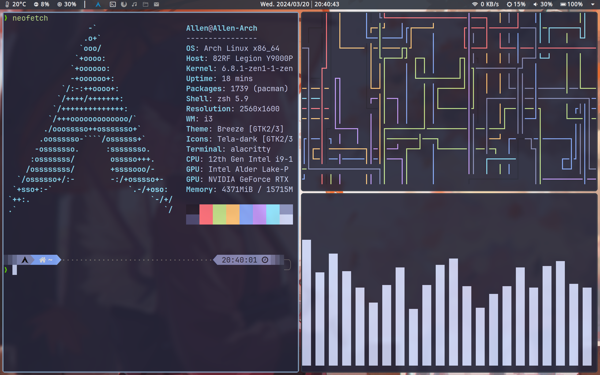
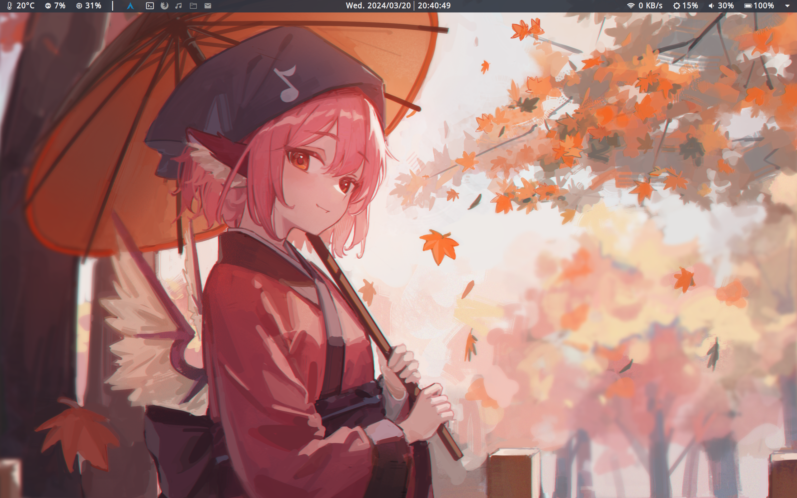

# Allen's personal dotfiles

## Overview

I use Archlinux + i3wm and the repo is my config.
There is a list of the packages I have installed: 

## Introduction

- WM: 
- Status bar: 
- Compositor: 

