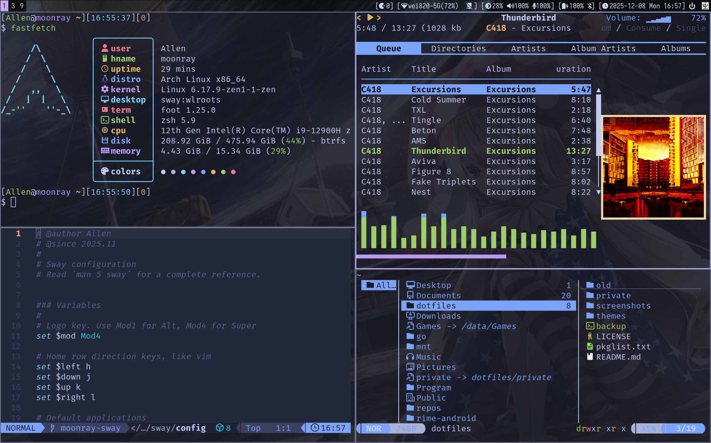
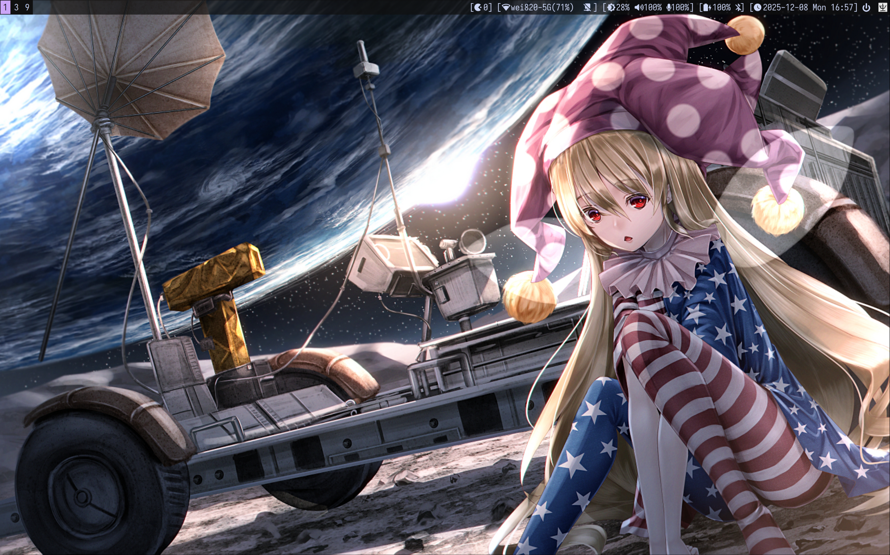

# Allen's personal dotfiles

## Overview

My Arch Linux dotfiles.

There is a list of the packages I have installed: 





## Usage

```Shell
# Clone this repository on codeberg
git clone https://codeberg.org/AllenWu233/dotfiles ~/dotfiles
# Or on github
git clone https://github.com/AllenWu233/dotfiles ~/dotfiles

# Create directories if needed to avoid dumping everything in dotfiles directory
mkdir -p "${HOME}/.local/share"
mkdir -p "${HOME}/.cache"

# Create symlinks with GNU Stow
cd ~/dotfiles
# Recover dotfiles repo with local files if exist
stow -t ~ . --adopt -R
# Or
#
# Dry Run
# stow -t ~ . --override='*' -v -n
#
# Warning: This command will recover local file with dotfiles
# stow -t ~ . --override='*' -v
```

## Introduction

- Window Manager (WM): [Sway](https://swaywm.org/), [Niri](https://github.com/YaLTeR/niri)
- /usr/bin/sh: [bash](https://www.gnu.org/software/bash/)
- Login Shell: [zsh](https://www.zsh.org/)
- Terminal Multiplexer: [zellij](https://github.com/zellij-org/zellij)
- Terminal Emulator: [foot](https://codeberg.org/dnkl/foot)
- Status Bar: swaybar (with [i3blocks](https://github.com/vivien/i3blocks))
- Output Management: [wlr-randr](https://github.com/emersion/wlr-randr)
- Application Launcher: [fuzzel](https://codeberg.org/dnkl/fuzzel)
- Fuzzy Finder: [fzf](https://github.com/junegunn/fzf)
- Notification Daemon: [mako](https://github.com/emersion/mako)
- Editor: [Neovim](https://neovim.io/)
- Email: [neomutt](https://neomutt.org/), [Thunderbird](https://www.thunderbird.net/)
- File Manager: [yazi](https://github.com/sxyazi/yazi), [thunar](https://docs.xfce.org/xfce/thunar/start)
- Music Player: [mpd](https://www.musicpd.org/), [rmpc](https://github.com/mierak/rmpc), [ncmpcpp](https://github.com/ncmpcpp/ncmpcpp)
- Video Player: [mpv](https://mpv.io/)
- Image Viewer: [imv](https://github.com/eXeC64/imv)
- E-book Reader / PDF Viewer: [zathura](https://pwmt.org/projects/zathura/), [zathura-pdf-mupdf](https://github.com/pwmt/zathura-pdf-mupdf)
- RSS Reader: [newsboat](https://newsboat.org/), [newsflash](https://apps.gnome.org/NewsFlash)
- Calendar/Todo: [taskwarrior-tui](https://github.com/kdheepak/taskwarrior-tui)
- Virtualization: [libvirt](https://libvirt.org/), [QEMU](https://www.qemu.org/), [virt-manager](https://virt-manager.org/)
- Web Browser: [Firefox](https://www.firefox.com)
- Downloader: [aria2](https://aria2.github.io/), [qBittorrent Enhanced](https://github.com/c0re100/qBittorrent-Enhanced-Edition)
- File Sync/Share: [rsync](https://rsync.samba.org/), [OpenSSH](https://www.openssh.com/), [KDE Connect](https://kdeconnect.kde.org/)
- Snapshot/Backup: [btrbk](https://digint.ch/btrbk/), [grub-btrfs](https://github.com/Antynea/grub-btrfs)
- AUR Helper: [paru](https://github.com/Morganamilo/paru)
- System Monitors: [btop](https://github.com/aristocratos/btop), [nvtop](https://github.com/Syllo/nvtop), [htop](https://htop.dev/)
- Dotfiles Manager: [GNU Stow](https://www.gnu.org/software/stow/) + [git](https://git-scm.com/)
