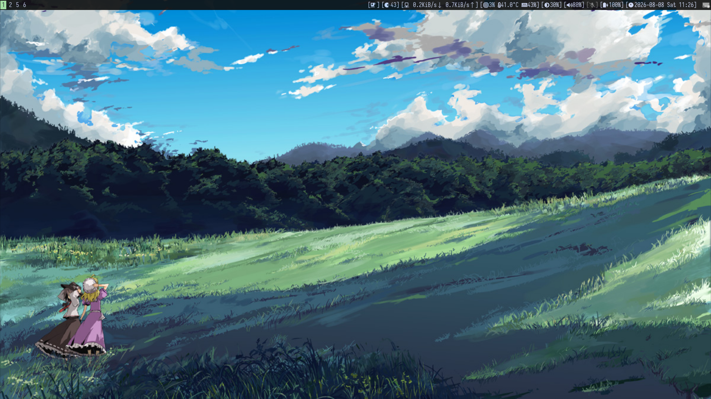
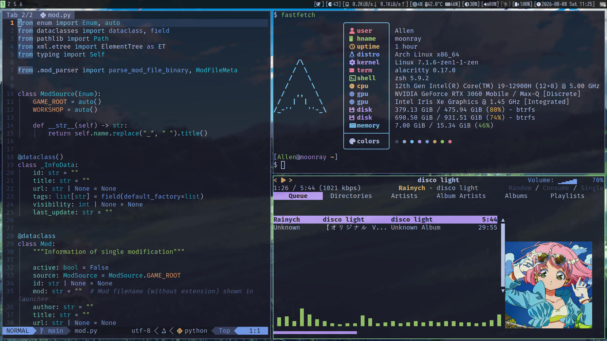

# Allen's Dotfiles

## Overview

My Arch Linux dotfiles.

There is a list of the packages I have installed: 





## Usage

```Shell
# Clone this repository on codeberg
git clone https://codeberg.org/AllenWu233/dotfiles ~/dotfiles
# Or on github
git clone https://github.com/AllenWu233/dotfiles ~/dotfiles

# Create directories if needed to avoid dumping everything in dotfiles directory
mkdir -p "${HOME}/.local/share"
mkdir -p "${HOME}/.cache"

# Create symlinks with GNU Stow
cd ~/dotfiles
# Recover dotfiles repo with local files if exist
stow -t ~ . --adopt -R
# Or
#
# Dry Run
# stow -t ~ . --override='*' -v -n
#
# Warning: This command will recover local files with dotfiles
# stow -t ~ . --override='*' -v
```
